# DETECTOR DE LIBROS 

*Por Andrea Guillermina Ramirez Altamirano*

## Ejecución y Funcionamiento

Para poder ejecutar iniciar el proceso para poder utilizar este código es necesario posicionarte en la pantalla inicial y presionar en el archivo que se muestra en la imagen. 

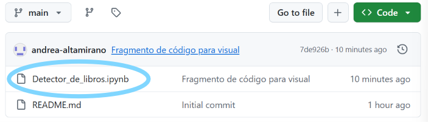

Una vez abierto el documento, entraras a una nueva pantalla donde podrás presionar un nuevo botón para visualizar los procesos en Google Colab. 

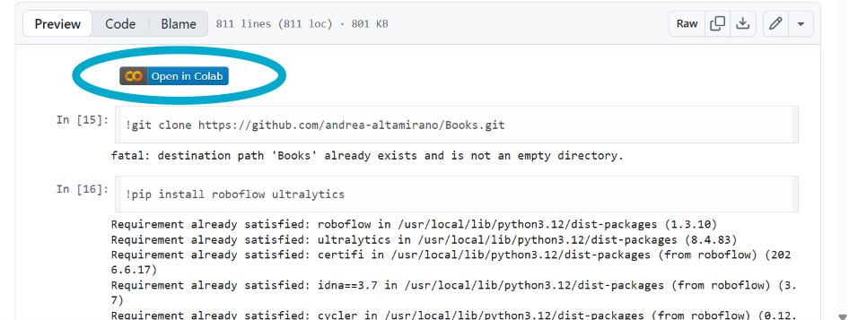

Una vez estando en el entorno de trabajo de google asegurate de estar utilizando en tu entorno de ejecución la GPU T4. Esto lo revisas en Entorno de ejecución/ Cambiar tipo de entorno de ejecución / Seleccionar GPU T4. 

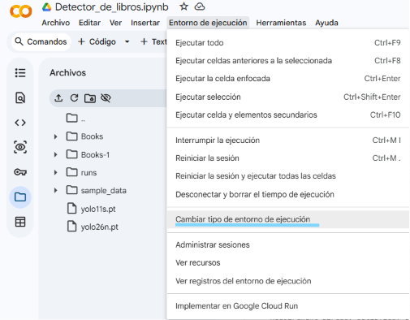
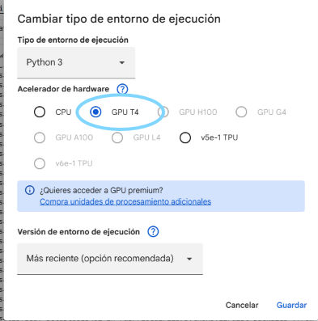

Para continuar, debes estar conectado a Google Colab y dar en ejecutar todo, hay un total de ocho celdas de las cuales siete se ejecutaran.

La primera solo copiara el reposito de GitHub

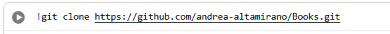

En la segunda encontraremos la descarga de las librerias

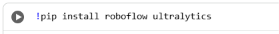

Para la tercera celda es dónde hacemos uso de una dataset previamente descargada de Roboflow con las caracteristicas buscadas para este proyecto. 

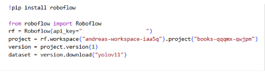

En la cuarta y quinta celdas encontraremos la carga del modelo utilizado para este proyecto y el entrenamiento a realizar. 

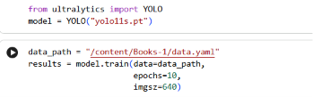
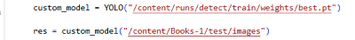

En la seis y siete se trabaja con los resultados obtenidos en base al entrenamiento realizado anteriormente. 

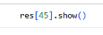

NOTA: Para poder ver los distintos resultados se debe de cambiar el numero que esta entre los corchetes de la celda siete.

Al final vemos un fragmento de código que esta comentado, ese código puede ser utilizado en Visual Studio, se necesita una Webcam, lenguaje en Python, el archivo best generado en Google Colab y un instador para Ultralytics que encontraras en la parte ded abajo. 

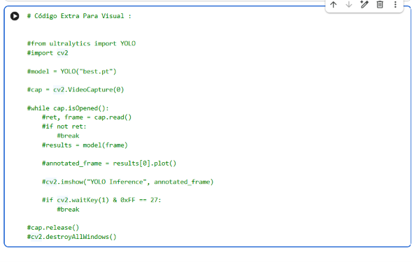
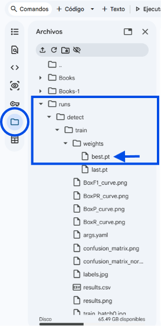

(Buscar los tres puntos al costado para descargr el archivo best.pt)

*Colocar en la terminal de Visual Studio lo siguiente:*

& "C:\Users\ruta_modificar" -m pip install ultralytics opencv-python

La gran ventaja de este modelo a diferencia de otros que encontramos en línea es que los documentos y fotos se crean o se instalan en el entorno de Google Colab, por lo que no es necesario ninguna descarga externa en el dispositivo. Al momento de desconectarse los documentos se eliminaran y hasta no volver a conectarse y ejecutar estos se crearan.

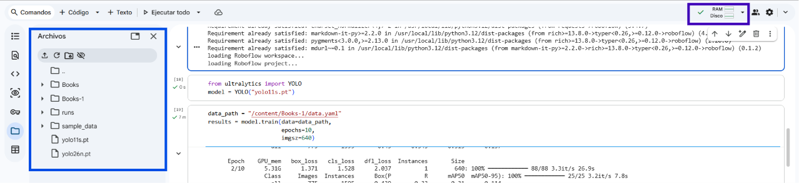

## Caso de Estudio: Monitoreo de Estantes

En almacenes, bibliotecas y centros de distribución de gran escala, la gestión del inventario enfrenta desafíos  debido a la gran cantidad de estanterías. Revisar manualmente cada nivel para verificar la disponibilidad o el orden de los libros es una tarea tardada y propensa a errores humanos. El reto principal es implementar un sistema capaz de detectar automáticamente cuando los espacios están correctamente ocupados, cuando requieren reabastecimiento o cuando están bloqueados por objetos ajenos.

Para implementar esta solución, se requiere una infraestructura de monitoreo visual compuesta por cámaras de video instaladas en puntos estratégicos de las estanterías. Estas cámaras se conectan a una unidad de procesamiento local  capaz de ejecutar modelos de visión artificial. Este diseño permite procesar la información de manera autónoma sin depender de una conexión constante a servidores externos, garantizando una respuesta rápida y eficiente.

El sistema opera mediante un escaneo continuo del campo de visión asignado, clasificando el contenido en tiempo real entre "Libro" o ningun objeto identificado. Cuando el modelo detecta la ausencia de libros en un espacio destinado para ello, el sistema registra el área como "Disponible para stock" y actualiza la base de datos central. Por el contrario, si se detecta un vacio, el sistema  genera una alerta inmediata.

Gracias a esta automatización, el personal de almacén solo recibe notificaciones cuando es estrictamente necesario, permitiendo avances rápidos y precisos. Este flujo  optimiza los tiempos de inventario y también garantiza que las áreas de almacenamiento se mantengan organizadas y accesibles. Con este modelo binario, se logra una solución escalable y de bajo costo que transforma la logística física en un proceso inteligente y altamente monitoreado.

## Resultados y Evidencia

